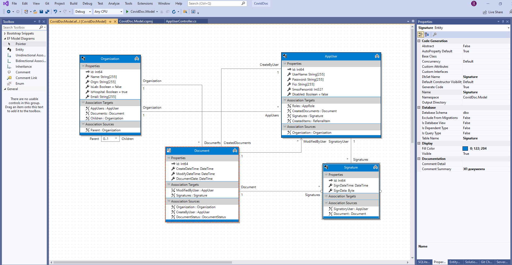

# CovidDoc

EF модель разрабатывал используя надстройку Entity Framework Visual Editor (https://marketplace.visualstudio.com/items?itemName=michaelsawczyn.EFDesigner)
Это визуальный редактор модели, генерирующий DbContext и Entity классы

В WebApi показаны только базовые классы (в т.ч. Generic контроллер - основа для унаследованных контроллеров сущностей)

Реализована автогенерация контроллеров для списка entity классов (разработан Design-time T4 шаблон см. Controllers.tt)

Подключена OData 8, после реализации контроллеров сущностей будет возможность OData параметризированных запросов 
с фильтрацией, сортировкой, paging и прочими плюшками OData

Также присутствует базовая служба безопасности приложения SecurityService, 
реализующая ограничения доступа в зависимости от ролей текущего пользователя

Это далеко не законченое решение, но общее впечатление о качестве кода, думаю, составить можно
